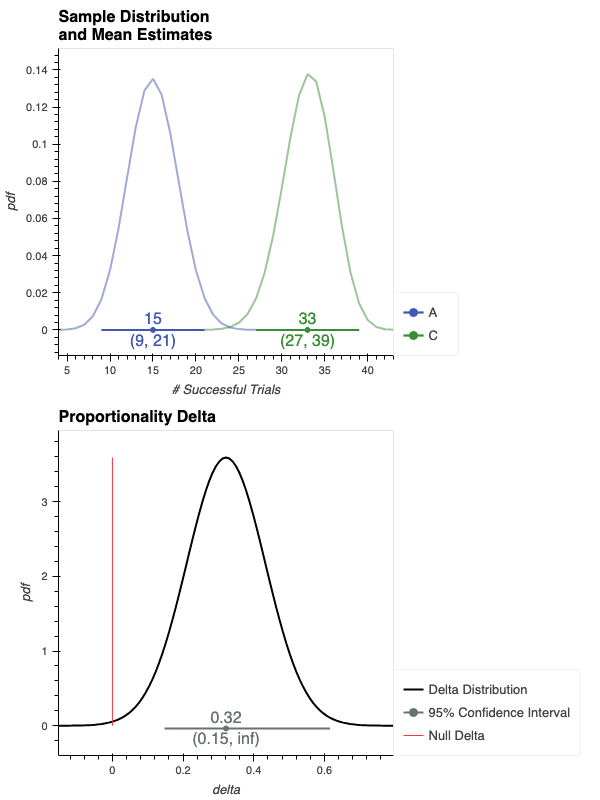

#  <span style="color:00A33D"> _spearmint_ </span> 

<!--  -->
<a href="https://github.com/dustinstansbury/spearmint/blob/main/LICENSE"></a>
[](https://github.com/psf/black)


[](https://codecov.io/gh/dustinstansbury/spearmint)


## Features
- Offers a simple API for running, visualizing, and interpreting statistically-rigorous hypothesis tests with none of the hastle of jumping between various statistical or visualization packages.
- Supports most common variable types used in AB Tests inlcuding, continuous, binary/proportions, counts/rates data.
- Implements many Frequentist, Bayesian, and Bootstrap inference methods
- Supports multiple customizations:
    + Custom metric definitions
    + Simple Bayesian prior definition
    + Easily extendable to support new inference methods

## Installation (WIP)

### Requirements
- `spearmint` has been tested on `python>=3.10`.

### Install via `pip`

```bash
pip install spearmint # not yet on PyPI
```

If you plan to run your analyses in `jupyterlab`, you can add the `notebook` option

```bash
pip install spearmint[notebook]
```

### Install via `conda` (WIP)

```bash
conda install -c conda-forge spearmint # not yet on conda-forge
```

### Install from source
If you would like to contribute to spearmint, then you'll want to install from source (or use the `-e` flag when installing from `PyPI`):

```bash
mkdir /PATH/TO/LOCAL/SPEARMINT && cd /PATH/TO/LOCAL/SPEARMINT
git clone git@github.com:dustinstansbury/spearmint.git
cd spearmint
pip install -e .
```

## Basics Usage

### Observations data
Spearmint takes as input a [pandas](https://pandas.pydata.org/) `DataFrame` containing experiment observations data. Each record represents an observation/trial recorded in the experiment and has the following columns:

- **One or more `treatment` columns**: each treatment column contains two or more distinct, discrete values that are used to identify the different groups in the experiment.
- **One or more `metric` columns**: these are the values associated with each observation that are used to compare groups in the experiment.
- **Zero or more `attributes` columns**: these define additional discrete properties assigned to the observations. These attributes can be used to perform segmentation across groups.

To demonstrate, let's generate some artificial experiment observations data. The `metric` column in our dataset will be a series of binary outcomes (i.e. `True`/`False`). This binary `metric` is analogous to *conversion* or *success* in AB testing.
```python
from spearmint.utils import generate_fake_observations

"""Generate binary demo data"""
experiment_observations = generate_fake_observations(
    distribution="bernoulli",
    n_treatments=3,
    n_attributes=4,
    n_observations=120,
    random_seed=123
)
experiment_observations.head()
```

These fake observations are simulated from a different Bernoulli distributions, each distribution being associated with the three `treatement`s (named `"A"`, `"B"`, or `"C"`), and each distrubition having increasing average probability of *conversion*. The simulated data also contains four `attribute` columns, named `attr_*`, that can potentially be used for segmentation.

```bash
   id treatment attr_0 attr_1 attr_2 attr_3  metric
0   0         C    A0a    A1b    A2a    A3a    True
1   1         B    A0a    A1b    A2a    A3b    True
2   2         C    A0a    A1a    A2a    A3b    True
3   3         C    A0a    A1a    A2a    A3b    True
4   4         A    A0a    A1b    A2a    A3a    True
```

## Running an AB test in spearmint is as easy as ✨1-2-3✨:

- 1. Initialize an **`Experiment`**, which holds the raw observations, and any metadata associated with an AB experiment.
- 2. Define the **`HypothesisTest`**, which declares the configuration of the statistical inference procedure.
- 3. Run the `HypothesisTest` against the `Experiment` and interpret the resulting **`InferenceResults`**. `InferenceResults`, hold the parameter estimates of the inference procedure, and are used to summarize, visualize, and save the results of the hypothesis test.


## Example Workflow
Below we demonstrate how to run a hypothesis test analysis on the fake observations data generated in a 1-2-3 fashion.

### 1. Initialize the `Experiment`

```python
from spearmint import Experiment
experiment = Experiment(data=experiment_observations)
```

Since the `metric` column in the simulated observations are binary (i.e. `True`/`False`), we'll essentially be running a test for the difference in success rates--i.e. what's the probability of observing a `True`--between two groups. This is analogous to running an AB experiment that aims to compare conversion rates (e.g. clicking a CTA, opening an email, signing up for a service, etc.) between a control and a variation group.

### 2. Define the `HypothesisTest`

Here, we test the `hypothesis` that that the conversion rate for `treatment` group `'C'` (the `variation`) is `'larger'` than for the `treatment` group `'A'` (the `control`, or reference group). 

```python
from spearmint import HypothesisTest

ab_test = HypothesisTest(
    treatment='treatment',
    metric='metric',
    control='A',
    variation='C',
    hypothesis='larger',
    # variable_type='binary',  # inferred from `metric` values
    # inference_method='frequentist'  # default
)
```

### 3. Run the test and interpret the `InferenceResults`
Here, we run our `HypothesisTest` with an acceptable Type I error rate of `alpha=0.05`

```python
ab_test_results = experiment.run_test(ab_test, alpha=0.05)
assert ab_test.variable_type == 'binary'  # check that correct variable_type inferred
assert ab_test_results.accept_hypothesis

"""Display test results to stdout"""
ab_test_results.display()
```
The test results displays two tables. The first table gives a summary of the observed samples from the control (`"A"`) and variation (`"C"`) groups. This `Samples Comparison` table gives the number of samples, the mean, variance, and standard error of the mean estimation, as well as the difference in mean estimates between the `variation` and `control` groups.

```bash
Samples Comparison
┏━━━━━━━━━━━━━━━━┳━━━━━━━━━━━━━━━━━━┳━━━━━━━━━━━━━━━━━━┓
┃                ┃ A                ┃ C                ┃
┡━━━━━━━━━━━━━━━━╇━━━━━━━━━━━━━━━━━━╇━━━━━━━━━━━━━━━━━━┩
│        Samples │ 35               │ 44               │
│           Mean │ 0.4286           │ 0.75             │
│ Standard Error │ (0.2646, 0.5925) │ (0.6221, 0.8779) │
│       Variance │ 0.2449           │ 0.1875           │
│          Delta │                  │ 0.3214           │
└────────────────┴──────────────────┴──────────────────┘
Proportions Delta Results
┌────────────────────┬──────────────────┐
│ Delta              │ 0.3214           │
│ Delta CI           │ (0.1473, inf)    │
│ Delta-relative     │ 0.75 %           │
│ Delta-relative CI  │ (34.3703, inf) % │
│ Delta CI %-tiles   │ (0.05, inf)      │
│ Effect Size        │ 0.6967           │
│ alpha              │ 0.05             │
│ Power              │ 0.92             │
│ Variable Type      │ binary           │
│ Inference Method   │ frequentist      │
│ Test statistic (z) │ 3.47             │
│ p-value            │ 0.0003           │
│ Hypothesis         │ C is larger      │
│ Accept Hypothesis  │ True             │
└────────────────────┴──────────────────┘
```
The second table shows a summary of the results from the hypothesis test inference procedure.

#### Interpreting inference results

We first see that this test uses a `Proportions Delta` inference procedure. Each inference procedure will test for the `Delta` in expected value between the two groups. For `"binary"` variables, this expected value is the _proportionality_ or  _average conversion rate_.  For `"continuous"` variables the expecteted value is the mean, for `"count"` variables the expected value will be expected number of events observed.

We see that there is a larger proportionality (e.g. conversion rate) for the `variation` group `'C'`, when compared to that of the `control` group `'A'`. Specifically there is a `Delta` of 0.32 in expected value between the two groups.

The results also report confidence intervals `CI` around the `Delta` estimates. Since the `hypothesis` is `"larger"`, the lower bound of the `CI` is $1-\alpha$ %, while the upper bound of the condifence intervals is $\infty$; these bounds are given by `Delta CI %-tiles`.

Along with absolute `Delta`, we report the `Relative Delta`, here a 75% relative increase. `Delta Relative` estimates also have associated `CI`s.

The size of the `Delta` in proportionality is moderately large, as indicated by an effect size of 0.70. This test also results in a `p-value` of 0.0003, which is lower than the prescribed $\alpha=$ 0.05. Thus the Hypothesis test declares that the `hypothesis` that `'C is larger'` should be accepted.


#### Visualizing `InferenceResults`

In addition to `.display()`ing the test results to the console, we can `.visualize()` the results.

```python
ab_test_results.visualize()
```

<div style="text-align:center"></div>

The left plot shows each Samples's estiamated parametric distribution, as well as the estimates of group central tendency and 95% Confidence Intervals (CIs) around those estiates (plotted as intervals along the x-axis). Non-overlapping distributions and CIs provides strong visual evidence that the difference between the two groups' central tendencies is statistically significant.

The right plot shows the `Delta` distribution over the _difference_ in those estimated sample distributions, along with 95% CIs. Delta CIs greater than zero give further visual evidence that the difference in the two samples is statistically significant.

---

 **💡 NOTE**

For `"binary"`, `"frequentist"` tests--i.e. `Proportions Delta` tests--we display the inference results for the observed Samples (i.e. the left `ab_test_results.visualize()` plot) as binomial distributions, giving the distribution over the expected number of successful trials given the total number observations and the number of `True`/`False` trials per group.

---

## [Additional Documentation and Tutorials](https://github.com/dustinstansbury/spearmint/blob/master/docs)
For more details of using `spearmint`'s API see the [Spearmint Basics Notebook](https://github.com/dustinstansbury/spearmint/blob/main/docs/spearmint_basics.ipynb)

## [CHANGELOG](./CHANGELOG.md)


