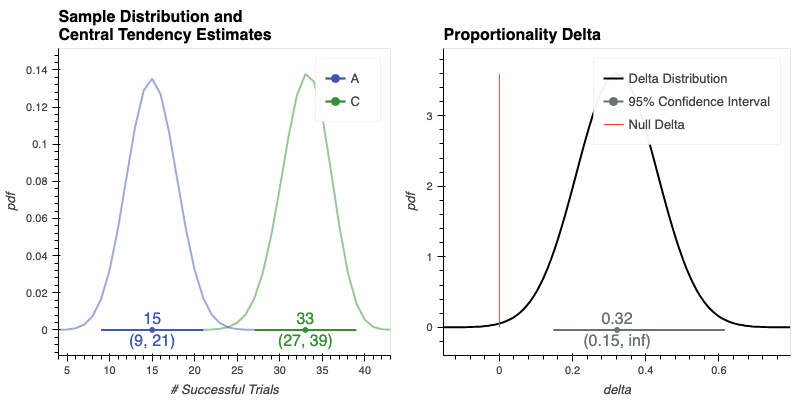

#  <span style="color:00A33D"> _spearmint_ </span> 

<!--  -->
<a href="https://github.com/dustinstansbury/spearmint/blob/main/LICENSE"></a>
[](https://github.com/psf/black)


[](https://codecov.io/gh/dustinstansbury/spearmint)


# ⚠️ This fork is a WIP ⚠️
 This repo was forked (and detached) from [abracadabra](https://github.com/quizlet/abracadabra), which AFAICT, is no longer being maintained. The goals of the fork are to...
- [X] update to newer version of python (>=3.10)
- [X] update to 100% Python
  - [X] convert all Stan MCMC models to PyMC5
  - [X] use analytic solutions to Bayesian inference where possible (e.g. conjugate prior models)
- [X] improve reporting
  - [X] better terminal output (e.g. via rich)
  - [X] modern interactive plotting
- [X] More intuitive API
- [ ] Add conda-forge install option (particularly helpful for Mac ARM64 architectures)

## Features
- Offers a simple and intuitive, yet powerful API for running, visualizing, and interpreting statistically-rigorous hypothesis tests with none of the hastle of jumping between various statistical or visualization packages.
- Supports most common variable types used in AB Tests inlcuding:
    + Continuous
    + Binary/Proportions
    + Counts/Rates
- Implements many Frequentist, Bayesian, and Bootstrap inference methods
- Supports multiple customizations:
    + Custom metric definitions
    + Simple Bayesian prior definition
    + Easily extendable to support new inference methods


## Installation (WIP)

### Requirements
- spearmint has been tested on `python>=3.10`.

### Install via `pip`

```bash
pip install spearmint # not yet on PyPI
```

If you plan to run your analyses in `jupyterlab`, you can add the `notebook` option

```bash
pip install spearmint[notebook]
```

### Install via `conda`

```bash
conda install -c conda-forge spearmint # not yet on conda-forge
```

### Install from source
If you would like to contribute to spearmint, then you'll probably want to install from source (or use the `-e` flag when installing from `PyPI`):

```bash
mkdir /PATH/TO/LOCAL/SPEARMINT && cd /PATH/TO/LOCAL/SPEARMINT
git clone git@github.com:dustinstansbury/spearmint.git
cd spearmint
pip install -e .
```

## `spearmint` Basics

### Observations data
Spearmint takes as input a [pandas](https://pandas.pydata.org/) `DataFrame` containing experiment observations data. Each record represents an observation/trial recorded in the experiment and has the following columns:

- **One or more `treatment` columns**: each treatment column contains two or more distinct, discrete values that are used to identify the different groups in the experiment
- **One or more `metric` columns**: these are the values associated with each observation that are used to compare groups in the experiment.
- **Zero or more `attributes` columns**: these are associated with additional properties assigned to the observations. These attributes can be used for any additional segmentations across groups.

To demonstrate, let's generate some artificial experiment observations data. The `metric` column in our dataset will be a series of binary outcomes (i.e. `True`/`False`, here stored as `float` values). This binary `metric` is analogous to *conversion* or *success* in AB testing. These outcomes are simulated from three different Bernoulli distributions, each associated with the `treatement`s named `"A"`, `"B"`, and `"C"`. and each of which has an increasing average probability of *conversion*, respectively. The simulated data also contains four `attribute` columns, named `attr_*`.

```python
from spearmint.utils import generate_fake_observations

"""Generate binary demo data"""
experiment_observations = generate_fake_observations(
    distribution="bernoulli",
    n_treatments=3,
    n_attributes=4,
    n_observations=120,
    random_seed=123
)
experiment_observations.head()
```

```bash
   id treatment attr_0 attr_1 attr_2 attr_3  metric
0   0         C    A0a    A1b    A2a    A3a    True
1   1         B    A0a    A1b    A2a    A3b    True
2   2         C    A0a    A1a    A2a    A3b    True
3   3         C    A0a    A1a    A2a    A3b    True
4   4         A    A0a    A1b    A2a    A3a    True
```

## Running an AB test in spearmint is as easy as ✨1-2-3✨:

The three key components of running an AB test are:

- **The `Experiment`**, which references the observations recorded during experiment (described above) and any optional metadata associated with the experiment.
- **The `HypothesisTest`**, which defines the hypothesis and statistical inference method applied to the experiment data.
- **The `InferenceResults`**, which is the statistical artifact that results from running a `HypothesisTest` against an `Experiment`'s observations. The `InferenceResults` are used to summarize, visualize, and interpret the inference results and make decisions based on these results.

Thus running an hypothesis test in spearmint follows the basic 1-2-3 pattern:

1. Initialize your `Experiment` with observations and (optionally) any associated metadata.
2. Define your `HypothesisTest`. This requires defining the `hypothesis` and a relevant `inference_method`, which will depend on the support of your observations.
3. Run the test against your experiment and interpret the resulting `InferenceResults`

We now demonstrate how to run and analyze a hypothesis test on the artificial observations data generated above. Since this simulated experiment focuses on a binary `metric` we'll want our `HypothesisTest` to use an `inference_method` that supports binary variables. The `"proportions_delta"` inference method, which tests for a significant difference in average probability between two different samples of probabilities is a valid test for our needs. Here our probabilities equal either `0` or `1`, but the sample averages will likely be equal to some intermediate value. This is analogous to AB tests that aim to compare conversion rates between a control and a variation group.

In addition to the `inference_method`, we also want to establish the `hypothesis` we want to test. In other words, if we find a significant difference in conversion rates, do we expect one group to be larger or smaller than the other. In this test we'll test that the `variation` group `"C"`has a `"larger"` average conversion rate than the `control` group `"A"`.

Below we show how to run such a test in spearmint.

```python
from spearmint import Experiment, HypothesisTest

"""1. Initialize the `Experiment`"""
exp = Experiment(data=experiment_observations)

"""
2. Define the `HypothesisTest`
Here, we test that the variation "C" is "larger" than the control "A",
based on the values of the "metric" column, using a Frequentist z-test,
as parameterized by `inference_method="proportions_delta"`
"""
ab_test = HypothesisTest(
    metric='metric',
    treatment='treatment',
    control='A',
    variation='C',
    hypothesis='larger'
)

"""
3. Run and interpret the `InferenceResults`
Here, we run our HypothesisTest with an assumed
Type I error rate of alpha=0.05
"""
ab_test_results = exp.run_test(ab_test, alpha=0.05)
assert ab_test_results.accept_hypothesis

"""Display test results to stdout"""
ab_test_results.display()
```

```bash
Samples Comparison
┏━━━━━━━━━━━━━━━━┳━━━━━━━━━━━━━━━━━━┳━━━━━━━━━━━━━━━━━━┓
┃                ┃ A                ┃ C                ┃
┡━━━━━━━━━━━━━━━━╇━━━━━━━━━━━━━━━━━━╇━━━━━━━━━━━━━━━━━━┩
│        Samples │ 35               │ 44               │
│           Mean │ 0.4286           │ 0.75             │
│ Standard Error │ (0.2646, 0.5925) │ (0.6221, 0.8779) │
│       Variance │ 0.2449           │ 0.1875           │
│          Delta │                  │ 0.3214           │
└────────────────┴──────────────────┴──────────────────┘
ProportionsDelta Results
┌────────────────────┬──────────────────┐
│ Delta              │ 0.3214           │
│ Delta CI           │ (0.1473, inf)    │
│ Delta-relative     │ 0.75 %           │
│ Delta-relative CI  │ (34.3703, inf) % │
│ Delta CI %-tiles   │ (0.05, inf)      │
│ Effect Size        │ 0.6967           │
│ alpha              │ 0.05             │
│ Power              │ 0.92             │
│ Variable Type      │ binary           │
│ Inference Method   │ frequentist      │
│ Test statistic (z) │ 3.47             │
│ p-value            │ 0.0003           │
│ Hypothesis         │ C is larger      │
│ Accept Hypothesis  │ True             │
└────────────────────┴──────────────────┘
```

### Interpreting inference results
We see that the Hypothesis test declares that the variation `'C is larger'` (than the control `A`), showing an increase in proportionality (e.g. conversion rate) of 0.32, which is 75% improvement relative to the control.

These deltas also have confidence intervals `CI` around their estimates. Since the hypothesis is "larger", the lower bound of the `CI` is $1-\alpha$ %, while the upper bound of the condifence intervals is $\infty$.

The size of the increase is moderately large, as indicated by an effect size of 0.70. This test also results in a p-value of 0.0003, which is lower than the prescribed $\alpha=$ 0.05, thus we accept the hypothesis that the average proportionality for C is larger than A.

#### Default `Variable Type`
Note that the `Variable Type` was inferred from the the `experiment_observations` as `"binary"`. You can also explicitly provide the variable type as with the `variable_type` argument to `HypothesisTest`. Other variable types in clude `"continuous"` and `"counts"`.

#### Default `Inference Method`
`spearmint` supports multiple inference methods, including `"frequentist"`, `"bayesian"`, and `"bootstrap"`. Above we didn't explicitly provide an inference method, but it defaults `"frequentist"`. This is the default behavior out-of-the-box, but can also be configured in your `.spearmint.cfg` by updating the config for `hypothesis_test.default_inference_method`.


#### Visualizing `InferenceResults`

```python
"""Visualize test's inference results"""
ab_test_results.visualize()
```

<div style="text-align:center"></div>

Note that for binary frequentist tests, we display the samples in the trials space as binomial distributions (as opposed to the proportionality space).

### Bootstrap Hypothesis Tests

If your samples are not well-characterized by standard parametric distributions (e.g. Gaussian, Binomial, Poisson), or if you're comparing more exotic descriptive statistics (e.g. median, mode, etc) then you might want to consider using a non-parametric [Bootstrap Hypothesis Test](https://en.wikipedia.org/wiki/Bootstrapping_(statistics)). Running bootstrap tests is easy in ✨spearmint✨, you simply use the `"bootstrap"` `inference_method`.

```python
"""Tests and data can be copied via the `.copy` method."""
bootstrap_ab_test = ab_test.copy(inference_method='bootstrap')

"""Run the Bootstrap test"""
bootstrap_ab_test_results = exp.run_test(bootstrap_ab_test)

"""Display results"""
bootstrap_ab_test_results.display()
```

```bash
Samples Comparison
┏━━━━━━━━━━━━━━━━┳━━━━━━━━━━━━━━━━━━┳━━━━━━━━━━━━━━━━━━┓
┃                ┃ A                ┃ C                ┃
┡━━━━━━━━━━━━━━━━╇━━━━━━━━━━━━━━━━━━╇━━━━━━━━━━━━━━━━━━┩
│        Samples │ 35               │ 44               │
│           Mean │ 0.4286           │ 0.75             │
│ Standard Error │ (0.2646, 0.5925) │ (0.6221, 0.8779) │
│       Variance │ 0.2449           │ 0.1875           │
│          Delta │                  │ 0.3214           │
└────────────────┴──────────────────┴──────────────────┘
BootstrapDelta Results
┌─────────────────────────────────┬───────────────────────┐
│ Delta                           │ 0.3219                │
│ Delta CI                        │ (0.1331, 0.4922)      │
│ Delta-relative                  │ 0.751 %               │
│ Delta-relative CI               │ (31.0606, 114.8561) % │
│ Delta CI %-tiles                │ (0.05, inf)           │
│ Effect Size                     │ 0.6976                │
│ alpha                           │ 0.05                  │
│ Power                           │ 0.88                  │
│ Variable Type                   │ binary                │
│ Inference Method                │ bootstrap             │
│ Test statistic (bootstrap_mean) │ 0.32                  │
│ p-value                         │ 0.003                 │
│ Hypothesis                      │ C is larger           │
│ Accept Hypothesis               │ True                  │
└─────────────────────────────────┴───────────────────────┘

```

```python
## Visualize Bayesian AB test results, including samples from the model
bootstrap_ab_test_results.visualize()
```

<div style="text-align:center"></div>


Notice that the `"bootstrap"` hypothesis test results above--which are based on resampling the data set with replacent--are very similar to the results returned by the `"proportions_delta"` parametric model, which are based on descriptive statistics and model the data set as a Binomial distribution. The results will converge as the sample sizes grow.

### Bayesian AB Tests

Running Bayesian AB Tests is just as easy as running a Frequentist test, simply change the `inference_method` of the `HypothesisTest`. Here we run Bayesian hypothesis test that is analogous to `"proportions_delta"` used above for conversion rates. The Bayesian test is based on the [Beta-Binomial model](https://en.wikipedia.org/wiki/Beta-binomial_distribution), and thus called with the argument `inference_method="beta_binomial"`.

```python
"""
Copy the parameters of the original HypothesisTest,
but update the `inference_method` for bayesian test
"""
bayesian_ab_test = ab_test.copy(inference_method='bayesian')
bayesian_ab_test_results = exp.run_test(bayesian_ab_test)
"""
Auto-assigning NUTS sampler...
Initializing NUTS using jitter+adapt_diag...
Multiprocess sampling (4 chains in 4 jobs)
NUTS: [p_control, p_variation]
Sampling 4 chains for 1_000 tune and 1_000 draw iterations (4_000 + 4_000 draws total) took 1 seconds.% [8000/8000 00:00<00:00 Sampling 4 chains, 0 divergences]
"""

assert bayesian_ab_test_results.accept_hypothesis

"""Display results"""
bayesian_ab_test_results.display()
```

```bash
Samples Comparison
┏━━━━━━━━━━━━━━━━┳━━━━━━━━━━━━━━━━━━┳━━━━━━━━━━━━━━━━━━┓
┃                ┃ A                ┃ C                ┃
┡━━━━━━━━━━━━━━━━╇━━━━━━━━━━━━━━━━━━╇━━━━━━━━━━━━━━━━━━┩
│        Samples │ 35               │ 44               │
│           Mean │ 0.4286           │ 0.75             │
│ Standard Error │ (0.2646, 0.5925) │ (0.6221, 0.8779) │
│       Variance │ 0.2449           │ 0.1875           │
│          Delta │                  │ 0.3214           │
└────────────────┴──────────────────┴──────────────────┘
Bayesian Delta Results
┌────────────────────┬──────────────────┐
│ Delta              │ 0.307            │
│ Delta HDI          │ (0.1122, 0.5044) │
│ Delta Relative     │ 77.03 %          │
│ Delta-relative HDI │ (11.51, 155.0) % │
│ Effect Size        │ 0.6718           │
│ Effect Size HDI    │ (0.2095, 1.1584) │
│ HDI %-tiles        │ (0.025, 0.975)   │
│ Credible Mass      │ 0.95             │
│ Variable Type      │ binary           │
│ Inference Method   │ Bayesian         │
│ Model Name         │ binomial         │
│ Estimation Method  │ mcmc             │
│ p(C > A)           │ 0.999            │
│ Hypothesis         │ C is larger      │
│ Accept Hypothesis  │ True             │
└────────────────────┴──────────────────┘
```

```python
"""Visualize Bayesian AB test results, including samples from the posterior"""
bayesian_ab_test_results.visualize()
```

<div style="text-align:center"></div>

Above we see that the Bayesian hypothesis test provides similar results to the Frequentist test, indicating a 45% relative lift in conversion rate when comparing `"C"` to `"A"`. Rather than providing p-values that are used to accept or reject a Null hypothesis, the Bayesian tests provides directly-interpretable probability estimates `p(C > A) = 0.999`, here indicating that there is 95% chance that the `variation` `"C"` is larger than the `control` `"A"`.

## [Additional Documentation and Tutorials](https://github.com/quizlet/spearmint/blob/master/docs)

## [CHANGELOG](./CHANGELOG.md)
